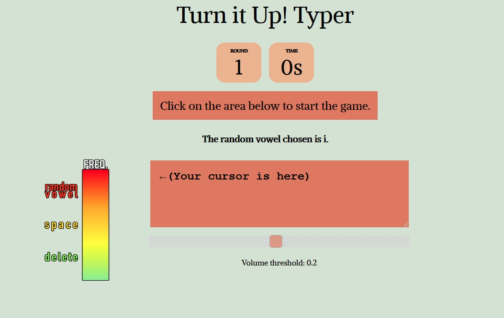

# TurnItUp!

<!-- ABOUT THE PROJECT -->

## About The Project

TurnItUp! is a web application for users to test out both their pitch and speed-typing skills in a fun and challenging way. TurnItUp brings a whole new dimension to a typical typing game by providing the rare experience of typing fast while hitting that high(and low) notes.

This project is a submission for [NUS Hack&Roll 2021](https://hacknroll.nushackers.org/).

<!-- USAGE EXAMPLES -->

## How to Use

Do make sure to allow the browser to access your microphone before starting the game.

For best results, use Firefox or Chrome browser.

<!-- LICENSE -->

## License

Distributed under the MIT License.

<!-- ACKNOWLEDGEMENTS -->

## Acknowledgements

- [Simple Pitch Detection](https://github.com/cwilso/PitchDetect/)
- [JS Simple Typing Game](https://github.com/sayantanm19/js-simple-typing-game)
